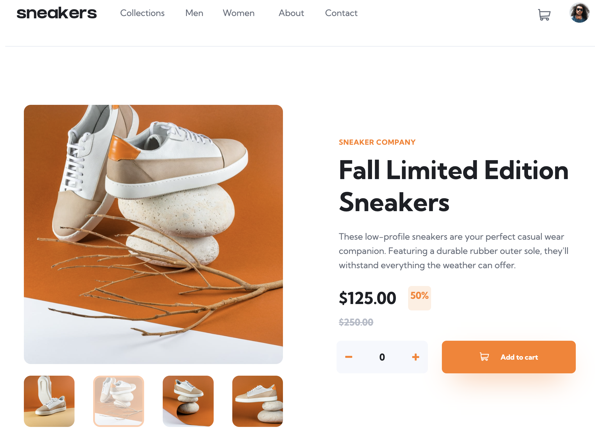
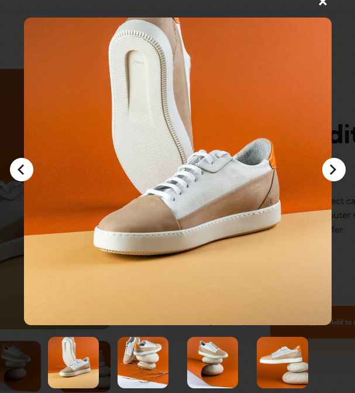
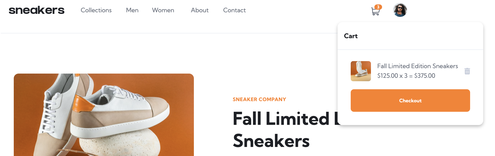

# Frontend Mentor - E-commerce product page

## The challenge

User requirements for the e-commerce product page:

- View the optimal layout for the site depending on their device's screen size
- See hover states for all interactive elements on the page
- Open a lightbox gallery by clicking on the large product image
- Switch the large product image by clicking on the small thumbnail images
- Add items to the cart
- View the cart and remove items from it
## Building the project

This project is built using the following:
* NextJS / React
* React Hooks: ``useCallback``, ``useEffect``, ``useState``, ``useRef``
* Typescript
* TailwindCSS

[Code](https://github.com/francisldn/fm-e-commerce/)

[Frontend](https://fm-e-commerce.vercel.app/)

## Challenges
#### Create Lightbox feature
* This is my first attempt at coding a lightbox feature. I have referred to a [youtube tutorial](https://www.youtube.com/watch?v=d3aI1Dt0Z50) which provides ideas about different ways of closing a lightbox (ie. 'escape' key, clicking outside the lightbox). Through the process, I learnt how to use ``useCallback`` hook in combination with ``useEffect``

#### Setting up Context API in NextJS
* Incredibly useful concept which I learnt is setting up Context api in NextJS. This allows the state and actions to be passed to different components easily. 
#### Typescript errors
* Also learnt about how to resolve typescript errors relating to ``useRef`` hook. Another instance of typescript error is different ways of typing ``event``. In particular, I realised that I need to denote ``React.MouseEvent`` for ``onClick`` event type, and not just ``MouseEvent``
#### Reusable React components and refactoring
* Through the process, I gained a deeper understanding of ways to create re-usable components in React and how to refactor the code to keep it DRY. 